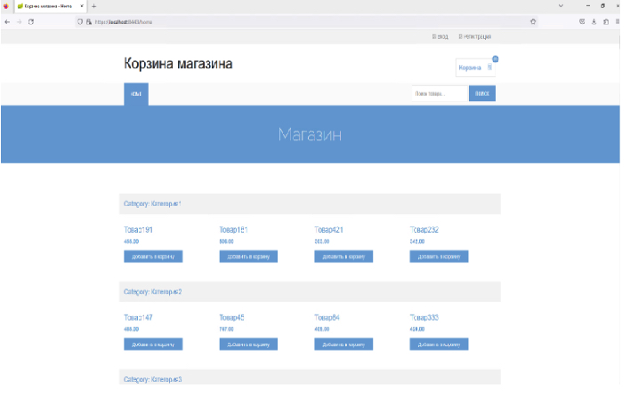

  

  
 Техническое задание

<h2>Назначение проекта</h2>

<h5>Корзина покупателя (отдельный сервис, для интернет-магазина)</h3>
<body>
   <dev>
   
Сервис позволяет:

     <ul>
     <li>Производить регистрацию и авторизацию пользователя;</li>
     <li>Просматривать товар, разнесенный по категориям;</li>
     <li>Личный кабинет, просмотр выписанных счетов;</li>
     <li>Отправка счетов на почту, просматривать статус счета;</li>
     <li>Для подключения использовать только https-протокол;</li>
     <li>Возможность работать через API;</li>   
     <li>Реализация frontend;</li>   
    </ul>
   

     </dev>

   <dev>
   <h2>О проекте</h2>
   
<h5>Основные возможности проекта:</h5>

 
Пошаговая презентация проекта 

   

     </dev>

  <dev>
     <h2>Сборка приложения:</h2>

   <dev>
   
Требуется выпольнить следующие шаги:

     <ul>
     <li>Сделать git clone этого проекта: <a href="https://github.com/BogomolovISerg/ShopCarts.git">https://github.com/BogomolovISerg/ShopCar git</a></li>
     <li>Собрать архив при помощи maven, используя команду в терминале: <code>mvn clean package</code></li>
     <li>Полученный архив из директории <code>target/carts.jar</code> закинуть по scp на Ваш удаленный сервер.</li>
     <li>Установить jre соответствующей версии и запустить проект: <code>java -jar /srv/carts.jar</code></li>
    </ul>
   

     </dev>
  <dev>
     </dev>
     <dev>
     <h2>Технические требования:</h2>

<ul>
     <li>JRE версии не ниже 17;</li>
</ul>